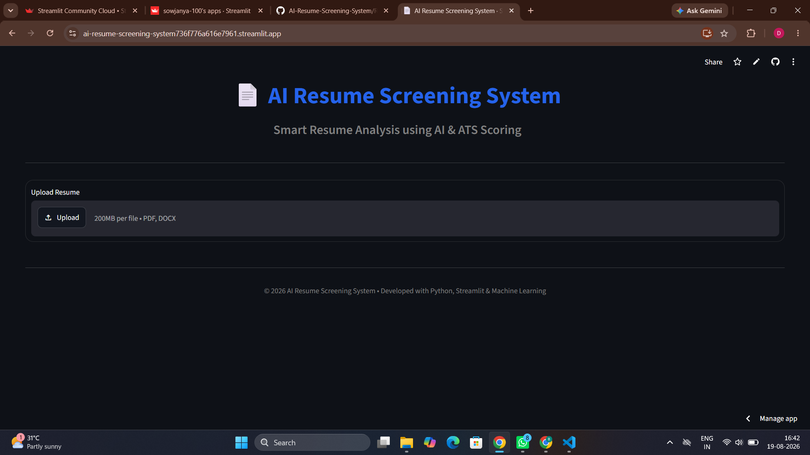
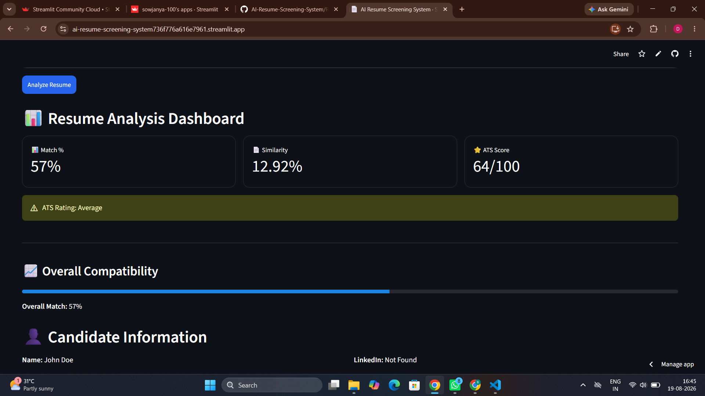
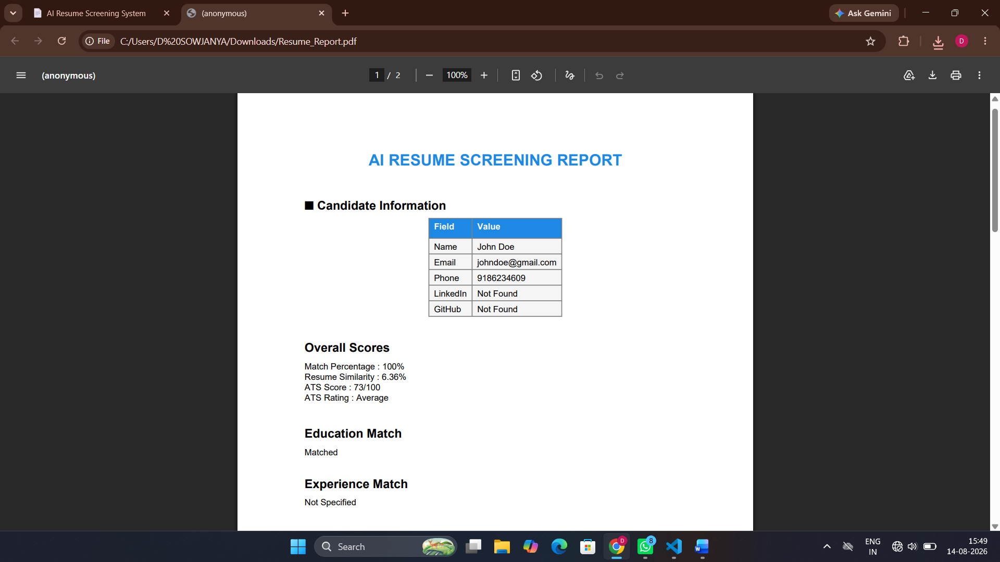

# 📄 AI Resume Screening System

An AI-powered Resume Screening System that analyzes resumes against job descriptions, calculates ATS scores, identifies skill gaps, evaluates education and experience, and generates a professional PDF report with personalized recommendations.

---

## 🚀 Features

- 📄 Upload Resume (PDF & DOCX)
- 📝 Paste Job Description
- 📊 Resume Match Percentage
- 🔍 Resume Similarity Score
- ⭐ ATS Score Calculation (0–100)
- 🎓 Education Matching
- 💼 Experience Matching
- 👤 Candidate Information Extraction
- ✅ Matched Skills Detection
- ❌ Missing Skills Detection
- 📈 Skill Distribution Pie Chart
- 🤖 Resume Insight
- 📚 Free Course Recommendations
- 🏆 Free Certification Recommendations
- 📑 Detailed ATS Analysis
- 📥 Professional PDF Report Generation

---

## 📸 Application Screenshots

### 🏠 Home Page


---

### 📊 Resume Analysis Dashboard



### 📑 Generated PDF Report


---

## 🛠️ Technology Stack

### Programming Language
- Python

### Frontend
- Streamlit

### Machine Learning & NLP
- Scikit-learn
- NLTK

### Data Processing
- Pandas
- NumPy

### Resume Parsing
- PyPDF2
- python-docx

### Visualization
- Matplotlib

### PDF Generation
- ReportLab

---

## 📂 Project Structure

```
AI-Resume-Screening-System/
│
├── app.py
├── requirements.txt
├── README.md
├── .gitignore
│
├── utils/
│   ├── ats_score.py
│   ├── charts.py
│   ├── feedback.py
│   ├── pdf_reader.py
│   ├── report_generator.py
│   ├── resume_analyzer.py
│   ├── similarity.py
│   └── course_recommender.py
│
├── uploads/
├── reports/
└── screenshots/
```

---

## ⚙️ Installation

### Clone the Repository

```bash
git clone https://github.com/sowjanya-100/AI-Resume-Screening-System.git
```

### Go to the Project Folder

```bash
cd AI-Resume-Screening-System
```

### Install Dependencies

```bash
pip install -r requirements.txt
```

### Run the Application

```bash
streamlit run app.py
```

---

## 🖥️ How It Works

1. Upload a resume (PDF or DOCX).
2. Paste the job description.
3. Click **Analyze Resume**.
4. The system:
   - Extracts resume text
   - Identifies candidate details
   - Matches skills
   - Calculates ATS Score
   - Evaluates education and experience
   - Generates AI feedback
   - Recommends courses and certifications
5. Download the professional PDF report.

---

## 📊 ATS Score Breakdown

The ATS score is calculated using the following criteria:

| Category          | Weight |
|-------------------|--------|
| Skills Match      |  40%   |
| Education         |  15%   |
| Experience        |  15%   |
| Projects          |  10%   |
| Certifications    |  10%   |
| Resume Formatting |  10%   |

---

## 🤖 AI Features

- Resume Skill Analysis
- ATS Score Calculation
- Education Matching
- Experience Matching
- Skill Gap Analysis
- AI Career Advisor
- Personalized Improvement Suggestions
- Learning Recommendations
- Professional Report Generation

---

## 📈 Future Enhancements

- Multi-resume comparison
- Resume ranking
- AI-powered resume rewriting
- Interview question generation
- Resume keyword optimization
- Recruiter dashboard
- Cloud database integration
- User authentication

---
## 👨‍💻 Developed By

**Dokkari Sowjanya**

 B.Tech (Computer Science & Engineering)

---

## ⭐ Support

If you found this project useful, consider giving it a ⭐ on GitHub.